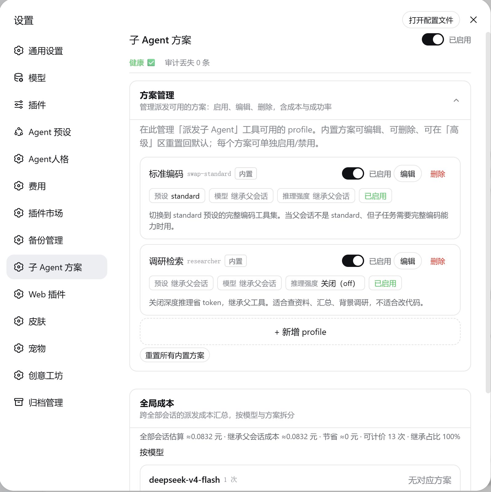
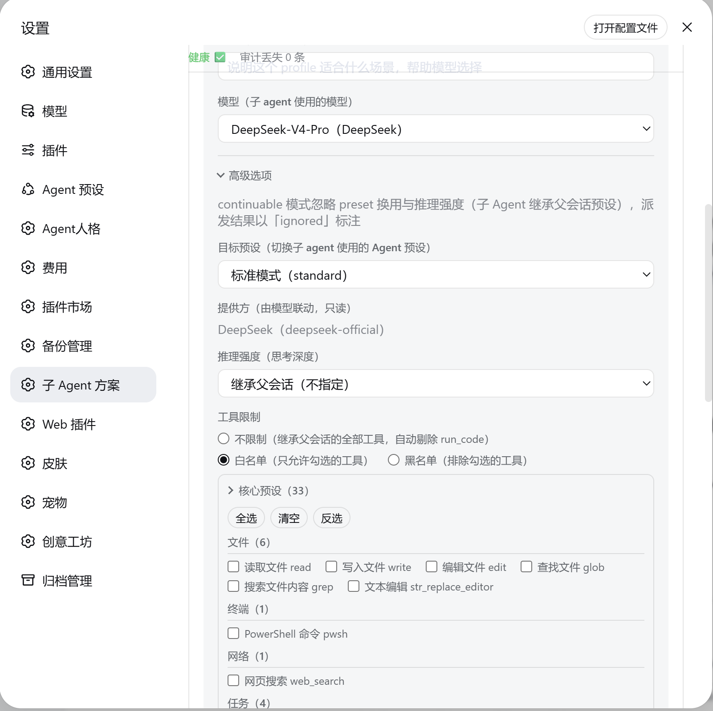
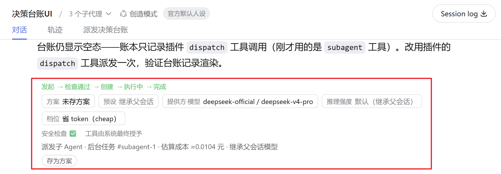

# dsh-subagent-profile

<!-- Hero -->
<div align="center">
  <b style="font-size: 1.15em;">Subagent dispatch, profiled — the right agent for the right task (preset / model / reasoning effort)</b><br /><br />
  
  
  
</div>

<div align="center">English · <a href="README.zh.md">中文</a></div>

For [DeepSeek Harness](https://github.com/deepseek-ai/dsh) (DSH).

> *Thinking, Fast and Slow*: System 1 is fast and cheap, System 2 is slow and careful. The built-in `subagent` gives every subtask the same brain as its parent — no way to tell them apart. `dsh-subagent-profile` lets you pick per subtask: research with a fast brain, deep work with a careful one, saved as named **profiles**.

## Why the built-in `subagent` isn't enough

| | Built-in `subagent` | `dsh-subagent-profile` |
|---|---|---|
| Per-subtask model / preset | ❌ same brain for every subtask | ✅ pick per subtask |
| Reusable named setups | ❌ | ✅ profiles |
| Tool-scope narrowing | ❌ | ✅ whitelist ∩ parent, `run_code` always removed |
| Cost guardrails | ❌ | ✅ model / effort / tokens / depth capped |
| GUI management | ❌ | ✅ settings page |

## What it solves

- **Per-subtask control over the child's brain.** `dispatch` sets, per subtask: which preset (composition), which model, which reasoning effort, which tools, and the token cap. A research subtask and a coding subtask can run with completely different setups — something the plain `subagent` tool can't do (it only inherits the parent).
- **Named, reusable profiles.** A profile is one bundle of preset + model + reasoning effort + tool scope + persona. Save "research" as `researcher` (reasoning off, search-only tools) and dispatch with `dispatch(profile="researcher")`; two built-ins ship (`swap-standard` = full standard coding toolkit, `researcher`), and you can add/edit/remove your own in the settings page.
- **Fully observable.** Every result reports the effective profile / preset / model / reasoning effort; logs are tagged `[dsh-subagent-profile]`.

## Quick start

```bash
dsh plugin --profile web add dsh-subagent-profile        # published package
dsh plugin --profile web add ./dsh-subagent-profile      # from a local checkout
```

Restart `dsh web`. This is a standard **bundle plugin**: it provides the `dispatch` tool, the profile provider, the `subagent-profiles` service, the `/subagent-profiles/*` loopback management routes, the settings page (「子 Agent 方案」), and the `dispatch` tool-call card in the web GUI. On startup it also **self-installs an agent preset** — **`orchestrator`** (「编排者模式」) — pick it in the new-session preset picker. The sync is idempotent and re-runs on every startup, so upgrading the plugin updates the preset.

## Usage

### 1. Configure sub-agent profiles

Profiles are managed in the settings page — each one bundles preset + model + reasoning effort + tool scope (and optionally a persona), and can be enabled, disabled, edited, or reset individually.





### 2. Dispatch per subtask — the `dispatch` tool

```js
dispatch(
  profile: "researcher",        // preset + model + reasoning effort + tool scope
  prompt: "Survey the DSH plugin ecosystem and compare direct competitors",
  run_in_background: true
)
```



## Profiles

Profiles live in `~/.dsh/subagent-profiles.json` and take effect immediately (edits are made from the settings page).

| Profile | Purpose |
|---|---|
| `swap-standard` | switch the child to the full standard coding toolkit |
| `researcher` | deep reasoning off, search-only tools |

## Safety model

Delegation never lets a subagent gain more power than you already have — this is the default, with no configuration:

- **Tools only shrink.** A child's tool set is the intersection of the profile's tools and the parent's tools, and `run_code` is always removed.
- **Approval is always "never".** A child cannot widen its own permissions; operations that need approval are rejected automatically.
- **Cost is capped.** Model, reasoning effort, tokens, and recursion depth are all bounded; out-of-range values fail loudly instead of silently downgrading.

## Data

- `~/.dsh/subagent-profiles.json` — the profile registry (edited from the settings page).
- `~/.dsh/subagent-profiles.state.json` — the plugin's enable/disable switch (default enabled).
- `~/.dsh/subagent-profiles.failed-traces.json` — the failure ledger (dispatch failure traces).
- `~/.dsh/.agent-presets/orchestrator/` — the self-installed `orchestrator` agent preset (synced from the bundled `presets/orchestrator/` on every startup).

`DSH_HOME` is respected and defaults to `~/.dsh`. Uninstalling the plugin removes the three data files above and the self-installed `orchestrator` preset directory (other plugins' presets are left untouched); re-installing or re-launching re-syncs the preset and regenerates the data files.

## Known limitations

- **Background** one-shot dispatch requires `@deepseek-ai/dsh-jobs` and `@deepseek-ai/dsh-tool-jobs` to be loaded; otherwise it fails with "dispatch: 后台派发不可用：缺少 jobs 服务".
- **Continuable** mode goes through the DSH standard composition path, so the `preset` swap and `reasoningEffort` are ignored (the child inherits the parent preset at the default reasoning effort).
- **Continuable** tool gate is a plugin-side mitigation: the child's `allow` is pre-computed as a closed set — parent tool set − `run_code` − `deny`, then intersected with `allow`. **Assumption:** continuable inherits the parent preset, so the child's tool set ≈ the parent's. **Failure condition:** any host behavior change that makes the child's tool set differ from the parent's (not only preset swap — e.g. a future preset swap, composing a different tool set) means the parent set can contain tools the child does not have, so `tools.restrict` throws "unknown tool" and this mitigation automatically degrades to fail-loud (conservatively safe); it must then be replaced with a true parent ∩ child intersection once the upstream provides a provider guard seam.

## Repository structure

```
dsh-subagent-profile/
├── index.mjs                     # host side: the plugin itself (dispatch tool, profile provider, service, HTTP routes)
├── lib/
│   ├── client.js                 # browser side: settings page + dispatch tool-call card
│   └── core/                     # host-side modules (lightweight layering)
│       ├── pure.mjs              # dependency-free pure functions (sanitize / prune / guard math — unit-tested)
│       ├── shims.mjs             # the single @deepseek-ai import facade (guards fail loud, helpers degrade softly)
│       └── *.mjs                 # catalog / whitelist / intersection / cost-guard / delegation / profiles-store /
│                                 #   presets-sync / http-routes / profile-provider / dispatch-tool
├── presets/orchestrator/         # bundled "orchestrator" agent preset (self-installed, synced on every startup)
├── cordis.patch.yml              # bundle patch: inserts the plugin row into the host composition
├── .gitea/workflows/ci.yml       # bare-CI (Gitea Actions; needs an Act runner on the server)
├── package.json                  # metadata, files whitelist, exports (test / test:bare / preflight scripts)
├── scripts/
│   ├── release.mjs               # release helper (version bump / tag checks)
│   └── preflight.mjs             # preflight: preset-tree reconciliation + no hardcoded version badge (zero-dep)
├── docs/
│   └── screenshots/              # README screenshots
├── test/                         # host-side tests (node:test, zero extra deps; 352 cases — bare subset in CI, junction local)
│   ├── README.md / README.zh.md  # test directory guide (EN/ZH) — two-tier split explained
│   ├── harness/ctx.mjs           # fake Cordis ctx + ~/.dsh isolation
│   ├── pure / input-schema / catalog-integrity.test.mjs   # bare tier (import-free, runs in bare CI)
│   └── characterization / facade / gating / persist / recycle / cost-guard / continuable-guard.test.mjs  # junction tier (local only)
├── README.md / README.zh.md      # this document (EN/ZH)
└── LICENSE
```

## Contributing

Found a bug or have an idea? [Open an issue](https://github.com/muzyLink/dsh-subagent-profile/issues) or submit a pull request — all contributions are welcome.

### CI (bare) & preflight

- **Gitea Actions** (`.gitea/workflows/ci.yml`): on `push` / `pull_request` to `v2-midterm` / `main`, runs the **bare-CI** subset — the tests that never load `@deepseek-ai` (`npm run test:bare`: pure / input-schema / catalog-integrity), `node --check` syntax checks, eslint (installed in isolation, since the bare environment cannot install the `@deepseek-ai` devDependencies), and `npm run preflight`. **Enabling Gitea Actions requires installing an Act runner on the server** (register it with the `ubuntu-latest` label); the workflow takes effect automatically once the runner is ready. Junction-dependent tests (characterization / facade / gating / persist / recycle / cost-guard / continuable-guard) run locally only — see `test/README.md` for the two-tier split and its rationale.
- **Preflight** (`npm run preflight`): zero-dependency self-check — ① reconciles the bundled `presets/` tree against a fresh `$DSH_HOME/.agent-presets` derived tree (byte-identical set, both directions; never touches the real `~/.dsh`), ② asserts the READMEs contain no hardcoded version badge (`badge/Version-v…` — the npm badge follows the published version automatically). Non-zero exit means drift — fix and re-run before release.

If this plugin has been useful to you, please give it a ⭐ on GitHub — it helps others find it.

## Credits

The bundled `orchestrator` agent preset was inspired by [dsh-liangshen](https://github.com/zhu1090093659/dsh-web-ui/tree/main/packages/dsh-liangshen) (梁神模式) from [dsh-web-ui](https://github.com/zhu1090093659/dsh-web-ui), licensed under Apache-2.0. Thanks to its author for the great work.

## License

[MIT](LICENSE) — Copyright (c) 2026 muzyLink
